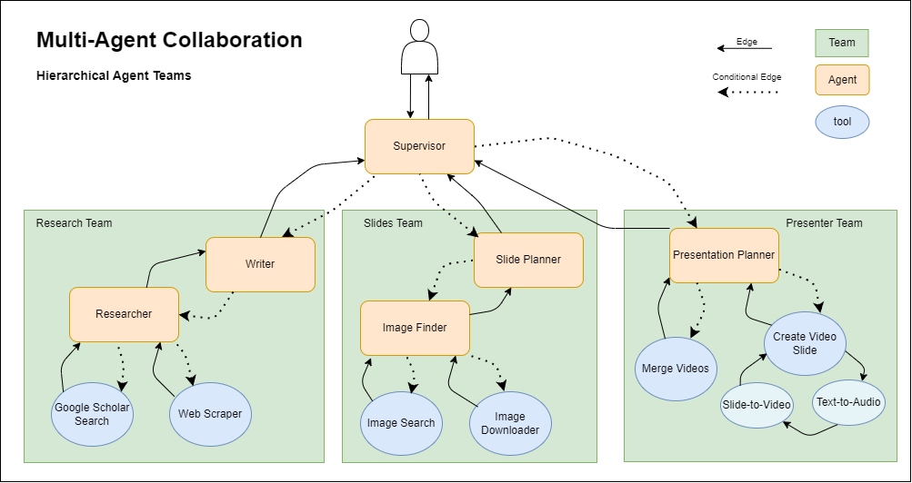

# MAC-SlideGenerator

Multi-Agent Collaboration: Voice-overed video slide generator

## Architecture



## Getting Started

Install Docker on your machine and run the following command at the root of the directory.

```bash 
docker build -t mac-slider-generator .
```

Create a `.env` file in the root directory and add the following:

```bash
OPENAI_API_KEY=Your_OpenAI_API_Key
SERP_API_KEY=Your_Serp_API_Key
LANGCHAIN_API_KEY=Your_LangChain_API_Key
LANGCHAIN_TRACING_V2=true
LANGCHAIN_PROJECT="Multi-agent Collaboration"
```
Run the following command to start the app

```bash
docker run --rm --env-file .env -it -v ${PWD}:/app mac-slider-generator
```

Further environment variables can be added to the `.env` file to customize the behavior of the app.

```bash
OPENAI_GPT_MODEL_NAME=Your_OpenAI_GPT_Model_Name
USE_OPENAI_FOR_TEXT_TO_AUDIO=Wether_to_use_OpenAI_for_text_to_audio
SLIDES_WATERMARK=Your_Slides_Watermark
EXTENDED_SLIDES=true
```

